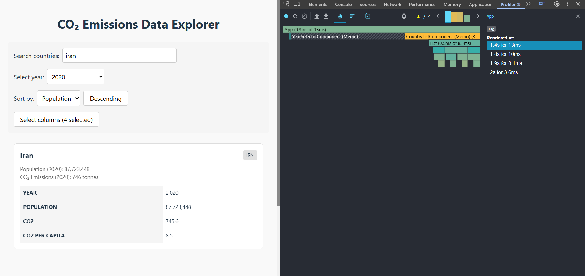
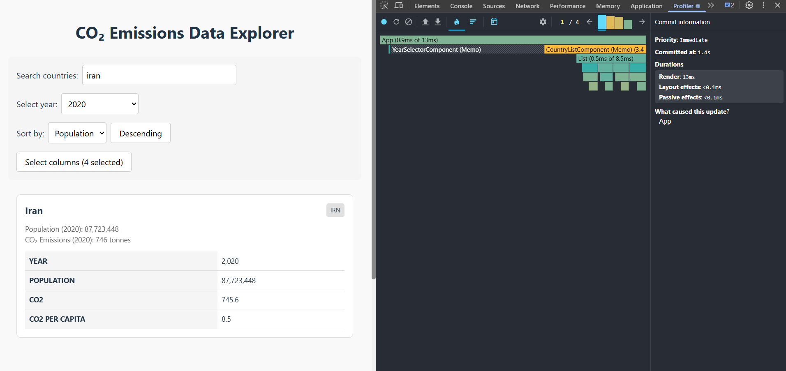
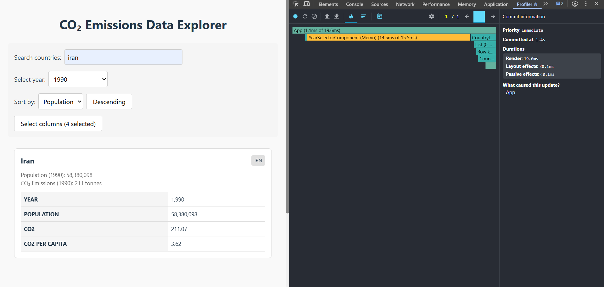
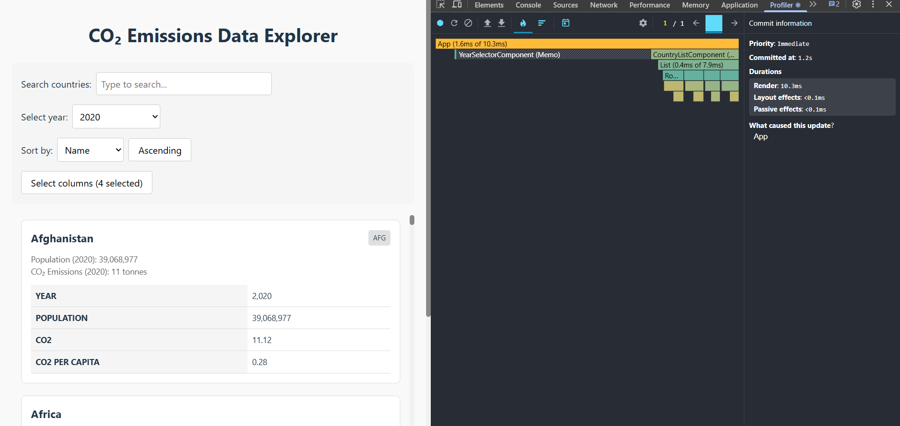
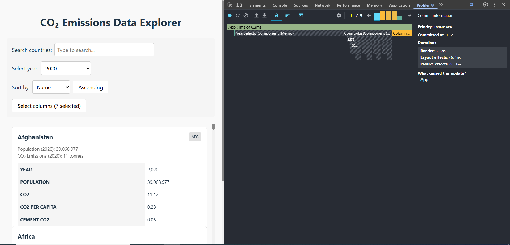
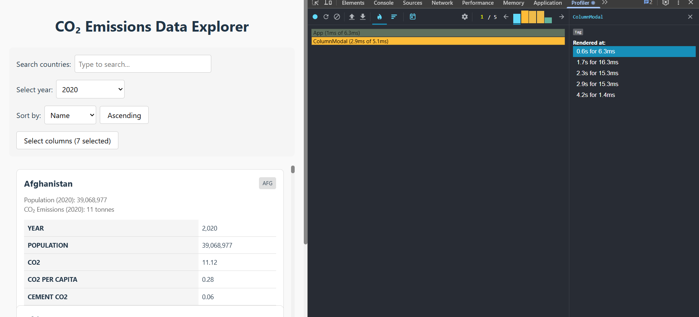

# react-performance

## Initial Profiling

* Search country

* Select year

* Sorting

* Select columns

## Final Profiling

* Search country

* Select year

* Sorting

* Select columns

## Before VS After

| script         | before (ms) | after (ms) | performance (%) |
|----------------|-------------|------------|-----------------|
| Search country | 286.1       | 13.1       | 95.4%           |
| Select year    | 25.5        | 19.6       | 23.1%           |
| Sorting        | 376.8       | 10.3       | 97.3%           |
| Select columns | 386.1       | 6.3        | 98.4%           |